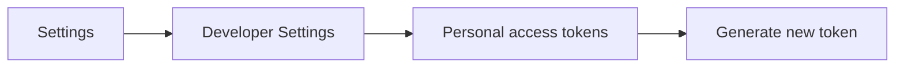

# publicRepos_mnbvc

## 项目描述

本项目主要用于获取GitHub和Gitee中的所有（或者后续新增）开源仓库信息，为后续的开源代码获取做准备。

## 前期准备

### AK获取

```mermaid
graph LR;
A[Settings] --> B[Developer Settings];
B[Developer Settings] --> C[Personal access tokens];
C[Personal access tokens] --> D[Generate new token];
```

